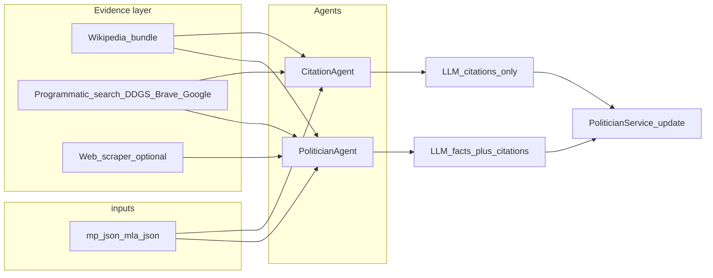

# Citation layer — knowledge base and task backlog

This document captures **research**, **what is already implemented** in Rajniti, **gaps**, and a **prioritized todo list** so any engineer can extend the citation / provenance pipeline without redoing discovery.

Related code lives under [`app/schemas/politician.py`](../app/schemas/politician.py), [`app/agents/`](../app/agents/), [`app/tools/`](../app/tools/), [`app/prompts/politician_prompts.py`](../app/prompts/politician_prompts.py), and [`scripts/`](../scripts/).

---

## 1. Goals and definitions

### What “citation layer” means here

Every **non-empty fact** exposed for an MP or MLA should be backed by a **machine-readable citation**: an HTTPS URL plus a coarse **source category** (`CitationSource`). The citation is stored next to (or keyed alongside) the fact in JSON (`mp.json`, `mla.json`) and surfaced in the UI where implemented.

Two agent modes matter:

| Mode | Purpose |
|------|---------|
| **Enrichment** | [`PoliticianAgent`](../app/agents/politician_agent.py) fills or updates factual fields **and** must attach citations (`missing_citations` validation rejects incomplete payloads). |
| **Citation audit** | [`CitationAgent`](../app/agents/citation_agent.py) proposes **URLs only**: it must **not** change factual text—only fills missing citations aligned by index/key. |

Both benefit from better **upstream evidence retrieval** (Wikipedia bundles, programmatic search, optional scraping)—that is the main forward work.

---

## 2. Product decision: Wikipedia and `CitationSource`

**Recommendation (logged for implementation):**

- **Do not add `CitationSource.WIKIPEDIA` immediately** unless the product explicitly wants Wikipedia labeled separately everywhere (backend schema, prompts, frontend [`CitationLink`](../frontend/components/CitationLink.tsx), audits).
- **Until then:** when the only acceptable URL for `summary_citation` is the encyclopaedia article itself, store **`NEWS`** on the narrow technical reading (“secondary / journalistic tertiary”) or **`OTHERS`** if you prefer a neutral bucket. Prompts today only allow `ECI | MYNETA | GOV_WEBSITE | NEWS | OTHERS`.
- **`summary_citation`:** Prefer **primary** URLs (Lok Sabha MP profile, assembly site, official party bio). Use **English Wikipedia article URL** only when no better HTTPS source exists—and treat it as **`OTHERS`** (or **`NEWS`** per team convention) consistently.
- **Attribution:** Storing **`link`** to `https://en.wikipedia.org/wiki/...` satisfies provenance at the UI level; redistribution of large Wikipedia **extract text** elsewhere may implicate CC BY-SA—the app mostly stores **URLs** and short **facts**, which is lighter risk.

If the team decides labels matter for analytics (“how much is wiki-sourced”), add **`WIKIPEDIA`** to [`CitationSource`](../app/schemas/politician.py), extend [`PoliticianPrompts`](../app/prompts/politician_prompts.py) citation rules + audit prompt, regenerate frontend types [`frontend/types/politician.ts`](../frontend/types/politician.ts), and migrate existing wiki-shaped URLs optionally.

---

## 3. Current implementation inventory (“done” baseline)

### 3.1 Data model (`app/schemas/politician.py`)

- **`Citation`**: `{ link: HttpUrl, source: CitationSource }`.
- **`CitationSource`**: `ECI`, `MYNETA`, `GOV_WEBSITE`, `NEWS`, `OTHERS`.
- **Arrays with embedded citation**: `Education`, `ElectionRecord`, `FamilyMember`, `CrimeRecord`.
- **`PoliticalBackground`**: `summary` / `summary_citation`, `elections[]` each with optional `citation`.
- **Parallel maps**: `contact_citations` (`email`|`phone`|`address`), `social_media_citations` (platform keys), `performance_citations` (`attendance`|`questions`|`debates`).
- **`citation_audit`**: arbitrary metadata blob (e.g. `issues`, `last_run`) updated by [`merge_citation_audit_updates`](../app/agents/citation_audit_merge.py).
- **`CitationAuditLLMResult`**: pydantic shape for citation-only LLM output.

### 3.2 Runtime `performance` attachment

[`PoliticianService`](../app/services/politician_service.py) loads [`app/data/performance.json`](../app/data/performance.json) and merges **`performance`** onto each politician dict by normalized name (**not** declared on [`Politician`](../app/schemas/politician.py) model). [`politician_needs_citation_audit`](../app/agents/citation_audit_merge.py) still expects **`performance_citations`** when MP performance fields are present.

### 3.3 Merge and coverage helpers

| Module / script | Role |
|-----------------|------|
| [`app/agents/citation_audit_merge.py`](../app/agents/citation_audit_merge.py) | `politician_needs_citation_audit`; `merge_citation_audit_updates` |
| [`scripts/report_citation_coverage.py`](../scripts/report_citation_coverage.py) | Counts MPs+MLAs missing any citation per same rules |

### 3.4 Prompting

[`app/prompts/politician_prompts.py`](../app/prompts/politician_prompts.py): `_CITATION_RULES` on all extraction prompts—real HTTPS citations, favour **primary** electoral / affidavit / gov sources.

[`citation_audit()`](../app/prompts/politician_prompts.py): JSON-only **`CitationAuditLLMResult`**-shaped patches, parallel arrays, optional `issues`.

### 3.5 Agents and context

[`BaseAgent`](../app/agents/base_agent.py):

- Initializes **web_search** (DuckDuckGo [`WebSearchTool`](../app/tools/web_search.py)), **web_scraper** ([`WebScraperTool`](../app/tools/web_scraper.py)), **wikipedia** ([`WikipediaTool`](../app/tools/wikipedia_tool.py)).
- **`_gather_politician_context`**: Wikipedia extract + formatted DDG snippets (plaintext blocks only today).
- **`_run_llm_with_context`**: prepends context above the prompt.

[`CitationAgent`](../app/agents/citation_agent.py): skips rows that pass `politician_needs_citation_audit` unless `--force`; uses context + citation audit prompt; persists via `PoliticianService.update_politician`.

[`PoliticianAgent`](../app/agents/politician_agent.py): validates citations across education, elections, summary, social, contact, family, criminal paths.

### 3.6 CLIs ([`readme.md`](../readme.md) references)

```text
python3 scripts/report_citation_coverage.py [--json]
python3 scripts/run_citation_agent.py [--id ID] [--type MP|MLA] [--limit N] [--force] [--log-level INFO]
```

### 3.7 Tests

- [`tests/unit/schemas/test_politician_citations.py`](../tests/unit/schemas/test_politician_citations.py): merge + predicates + pydantic quirks for citations.
- **`WikipediaTool`**: add **`tests/unit/tools/test_wikipedia_tool.py`** when implementing the bundle API described in §6 (Gaps and risks)—today the repo has **no** dedicated Wikipedia tests; regression risk until those land.

### 3.8 Frontend surfacing

Citations are **already wired** in the Next app:

- [`frontend/components/CitationLink.tsx`](../frontend/components/CitationLink.tsx)
- [`frontend/types/politician.ts`](../frontend/types/politician.ts) aligns with citation maps.
- [`frontend/app/politician/[id]/PoliticianPageClient.tsx`](../frontend/app/politician/[id]/PoliticianPageClient.tsx): summary, elections, education, family, criminal, contact, social, performance rows use `CitationLink`.

Backlog item is mainly **parity** when new citation fields appear, not greenfield UI.

---

## 4. Research: sourcing strategies (when to use what)

### 4.1 Wikipedia (MediaWiki + REST summaries)

**Strengths**

- No API key for `en.wikipedia.org` REST + query APIs; descriptive `User-Agent` required (already in [`wikipedia_tool.py`](../app/tools/wikipedia_tool.py)).
- Strong **routing signal**: canonical **`content_urls.desktop.page`**, **`extract`**, optional **`prop=parse` `externallinks`** filtering to outward official/news URLs.
- Scales reasonably for batch jobs with gentle concurrency.

**Limits**

- **Not primary** for election results vs affidavits; prompts already prefer **ECI / MyNeta / gov**.
- Weak for low-notability MLAs.

**Recommended use in Rajniti**

- Populate **context + suggested URLs**, not blindly set `ElectionRecord.citation` to Wikipedia.
- Ideal for **`summary_citation`** fallback URL when extract matches the politician (implement **verification**—see backlog).

---

### 4.2 Google Programmable Search and Brave Search

**Pattern:** API returns `{ title, url, snippet }`; model picks HTTPS candidates; optionally verify with **`WebScraperTool`**.

**Brave Search API**

- Commercial key; simple JSON APIs; candidate when DuckDuckGo is rate-limited or flaky under batch loads.

**Google Programmable Search (Custom Search JSON API)**

- Programmable Search **Engine CX** + API key; good relevance for **`site:`** gov domains; quotas and billing to monitor.

**Ops**

- Backoff + disk/Redis caching by query hash for repeatable batch citation runs.

**Recommended use**

- **Discovery** layer for affidavit pages, EC results pages, Vidhan Sabha / Lok Sabha profile URLs—same [`CitationAuditLLMResult`](../app/schemas/politician.py) downstream.

---

### 4.3 Browser automation (Playwright, etc.) vs Cursor MCP browser

**Use when**

- Targets are heavily **JS-rendered**, **session-gated**, or **CAPTCHA**-prone—and no stable API exists.

**Cost**

- Slower, flakier, higher operational burden; poorly suited as default per all ~thousands rows.

**Recommended use**

- **Targeted** scrapers / one-off remediation jobs; keep out of **`BaseAgent` hot path**.

---

## 5. Recommended target architecture

1. Keep **existing JSON citation shape** unchanged unless adding `WIKIPEDIA` (see §2).
2. Introduce a thin **Evidence / retrieval façade** (single module callable from [`BaseAgent._gather_politician_context`](../app/agents/base_agent.py)):
   - **Wikipedia bundle**: `{ article_url, extract, external_urls[] }`.
   - **Web discovery**: DuckDuckGo + optional Brave/Google keyed by env.
   - Optional **trusted-domain fetch pass** via [`WebScraperTool`](../app/tools/web_scraper.py) snippets (rate-limited).
3. **Governance**: block or flag citations where **linked page does not support** the fact (automated sniff or heuristic).

### Flow diagram



---

## 6. Gaps and risks

| Gap | Detail | Mitigation (backlog) |
|-----|--------|---------------------|
| **Wikipedia surface vs backlog** | Design calls for **`politician_wikipedia_bundle`** (+ **`article_url`**, **`externallinks`**); [`wikipedia_tool.py`](../app/tools/wikipedia_tool.py) today only **`search/summary/search_and_summarize/politician_context`**. Tests not yet checked in—add **`tests/unit/tools/test_wikipedia_tool.py`** alongside the richer API. | Implement bundle + encode-title helpers + mocked HTTP tests |
| **Context structure** | [`_search_wikipedia`](../app/agents/base_agent.py) returns plaintext only—no deterministic **article URL** bundle in prompts. | Pass structured Markdown/JSON-ish block listing candidate URLs |
| **Hallucinated URLs** | Models can cite non-existent HTTPS paths | Optional HEAD→GET verifier; domain allow/block lists; retry citation agent |
| **Single search backend** | Only DuckDuckGo in [`WebSearchTool`](../app/tools/web_search.py) today | Brave/Google backends + env-selected strategy |
| **Primary-source depth** | ECI/MyNeta not first-class deterministic tools—only prompts | Narrow link resolvers or templates per election year |

---

## 7. Operational runbook

### Environment knobs (subset)

[`BaseAgent`](../app/agents/base_agent.py):

- **`RAJNITI_LOG_LLM_RESPONSES`** (default on), **`RAJNITI_LLM_RESPONSE_LOG_MAX_CHARS`**, **`RAJNITI_LLM_MAX_CALLS`** throttle LLM during tests or dry runs.

### Coverage checklist

After batch citation runs:

1. Run `scripts/report_citation_coverage.py —json`; track `missing_citations` trending down.
2. Spot-check `citation_audit.issues` in JSON when merge leaves uncertainty notes.

---

## 8. Todo / task backlog

Ordered for execution. Check items off as you ship PRs.

### P0 — Foundation

- [ ] **Resolve Wikipedia drift:** implement **`politician_wikipedia_bundle`** (REST summary incl. **`content_urls`**, **`action=parse`** externallinks, title encoding compatible with `%2F`/dots) **and** add **`tests/unit/tools/test_wikipedia_tool.py`** (mocked **`httpx`**) **or** keep minimal API deliberately and document—it must match **whatever** tests exist so **CI stays green**.
- [ ] Extend [`BaseAgent._gather_politician_context`](../app/agents/base_agent.py) with a **structured** block listing **article URL**, **filtered external_links**, plus existing DDG text (clear delimiters reduce LLM misuse).
- [ ] Add **`summary_matches_wikipedia_extract`** usage (or equivalent fuzzy check) anywhere `summary_citation` would point at Wikipedia to avoid wrong-article merges.

### P1 — Search breadth + reliability

- [ ] Extend [`WebSearchTool`](../app/tools/web_search.py) (or sibling class) with **Brave** and/or **Google Programmable Search** behind env vars (`RAJNITI_BRAVE_API_KEY`, `RAJNITI_GOOGLE_CSE_KEY`, `RAJNITI_GOOGLE_CSE_CX`—exact names per implementation).
- [ ] Retry/backoff and **disk cache** (or **`CacheManager`**) keyed by politician id + retrieval kind for repeatable batch citation jobs.

### P2 — Trust and primary sources

- [ ] Lightweight **HTTP verification**: status 200 + content-type heuristic + optional substring match (`constituency`, surname) before persisting citations from LLM.
- [ ] **Domain hints** helpers in prompts (“prefer `eci.gov.in`, `prsindia.org`, state assembly portals, `myneta.info` affidavit PDFs”).
- [ ] Spike **narrow ECI / MyNeta URL builders** where metadata (year, AC/PC identifiers) appears in politician JSON—or document manual pattern library per state.

### P3 — Agent workflow + maintenance

- [ ] Decide on **`CitationSource.WIKIPEDIA`** (see §2); if yes, schema + prompts + frontend + migration—if no, codify **`OTHERS` convention** once in docs or README when owners agree (`feat/citation.md` §2 remains the authoritative note until then).
- [ ] Tune [`PoliticianPrompts.citation_audit`](../app/prompts/politician_prompts.py) when new retrieval fields arrive (“only cite HTTPS present in CONTEXT URL list” rule).
- [ ] Optional **`scripts/fix_wikipedia_summary_citations.py`** (present in workspace as untracked/experimental)—promote into documented maintenance flow or archive.

### P4 — Frontend / API parity

- [ ] When new citation surfaces appear backend-side, mirror in [`PoliticianPageClient`](../frontend/app/politician/[id]/PoliticianPageClient.tsx); today coverage is comprehensive for modeled fields—re-verify after schema changes.

### P5 — Stretch

- [ ] Bounded **browser automation** job for portals that repeatedly block http-only scraping.
- [ ] Metrics dashboard: citations per source enum, `%` primary vs secondary.

---

## 9. Appendix — key file paths

| Area | Path |
|------|------|
| Schema | `app/schemas/politician.py` |
| Merge / audit predicates | `app/agents/citation_audit_merge.py` |
| Agents | `app/agents/base_agent.py`, `citation_agent.py`, `politician_agent.py` |
| Prompts | `app/prompts/politician_prompts.py` |
| Tools | `app/tools/wikipedia_tool.py`, `web_search.py`, `web_scraper.py` |
| Performance merge | `app/services/politician_service.py`, `app/data/performance.json` |
| Data | `app/data/mp.json`, `app/data/mla.json` |
| CLIs | `scripts/run_citation_agent.py`, `scripts/report_citation_coverage.py` |
| Frontend citations | `frontend/components/CitationLink.tsx`, `frontend/app/politician/[id]/PoliticianPageClient.tsx` |

---

*Last updated when this feat doc was authored. Update §8 checkboxes as work lands.*
